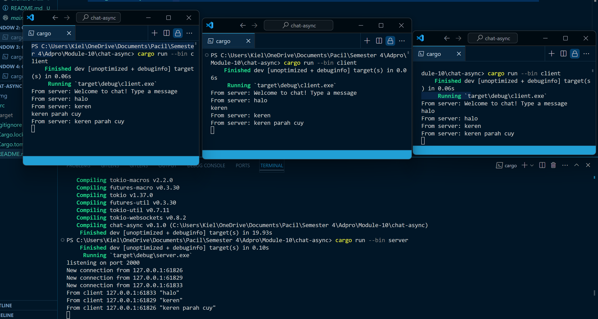
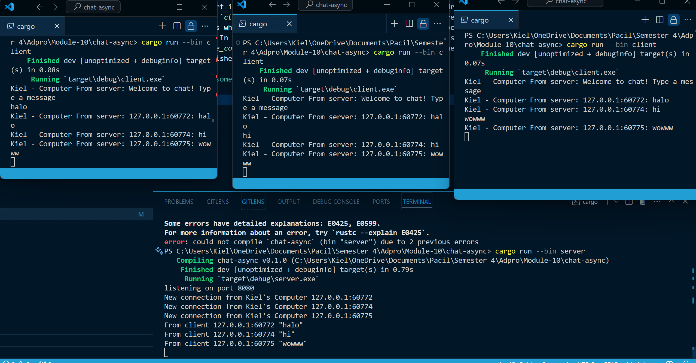

# Running the Server and Clients

I run the server by using the command cargo run --bin server.rs, while I run the client by using the command cargo run --bin client.rs. Here I run 3 client and 1 server where all the client will send a message to the server and the server will receive the message from the client and broadcasts it to all connected clients. The server and clients use WebSockets for communication. The server listens on port 2000 and accepts incoming connections. Each client connects to the server and sends any input from the user to the server.

# Modifying the port

To modify the port, we need to modify it in both server and client. in `server.rs`, we need to modify the port in the line where the TcpListener is bound to the address which is in the `main()` function. In the `client.rs` we need to modify the port in the line where the WebSocket is connected to the address which is in the `main()` function. The WebSocket protocol is used in both the server and client files. In the server file, it's used when the raw TCP stream is wrapped into a WebSocket in the `handle_connection` function. In the client file, it's used when the WebSocket connection is established with the `ClientBuilder::from_uri` function.

# Add some information to the client

in `server.rs`, i change the line `bcast_tx.send(text.into())?;` to `bcast_tx.send(format!("From {}: {}", addr, text))?;` This will prepend the sender's IP and port to each message. Next i also modified the print in `main()` to `println!("New connection from Kiel's Computer {addr:?}");` to make tell that the connection is from my computer. in `client.rs` i only added "Kiel - Computer" to line the print statement in the `main()` function to make it clear that the client is from my computer.